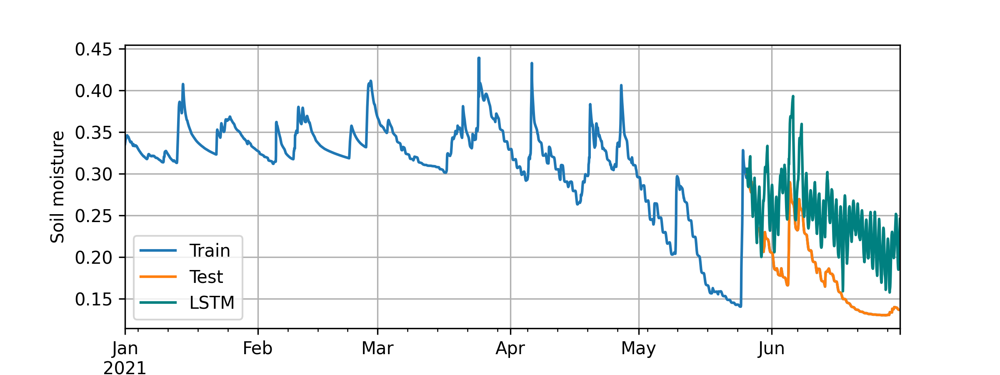

# SoilMoistureForecasting

Student project - Soil Moisture Dynamics Forecasting Supported with Neural Networsks

> We used ERA5 weather reanalysis and LSTM for soil moisture forecast

	
	 

## Requiremets 

`pytorch-lightning`

`xarray`

## Input data

Example of one point timeseries uploaded to github, full dataset uploaded to google drive

## Contacts

m.gasanov[a]skoltech.ru
